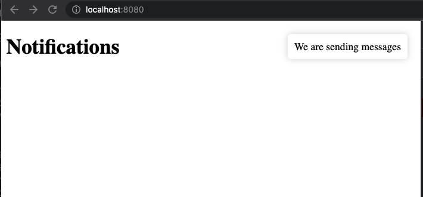

## ActionCable Client

This is a demo of how we can consume a Rails ActionCable channel. 

### Prerequisites

We assume that you have a Rails application with ActionCable. You need to generate a channel (in this demo, we use `NotificationsChannel`), and make sure it streams om connection.

The easiest way to create a channel is to use the built-in generator from your terminal:

```bash
$ rails g channel notifications
```

Make sure it looks like this:

```ruby
class NotificationsChannel < ApplicationCable::Channel
  def subscribed
    stream_from 'notifications_channel'
  end

  def unsubscribed
    # Any cleanup needed when channel is unsubscribed
  end

  def receive(data)
    # we will simply echo an incomming message back to the client (see futher down...)
    ActionCable.server.broadcast('notifications_channel', { message: data['message'] })
  end
end
```

Please note the you need to install redis and have the service up an dunning.

**OSX:** `brew install redis`
**Linux:** `apt-get install redis-server`

In your `config/cable.yml`, you'll find the configuration for your various environments. We used:

```yml
redis: &redis
  adapter: redis
  url: <%= ENV.fetch("REDIS_URL") { "redis://localhost:6379/1" } %>
  channel_prefix: recipe_hub_api_production

test:
  adapter: test
development: &redis
production: &redis
```

### Usage

Fork and clone (or just clone) this repo and install the dependencies. This is a vanilla JavaScript application, but we use [`http-server` package](https://www.npmjs.com/package/http-server) to spin up a web server. 

You will need to open 3 terminals.

1. Start your Rails application: `$ rails s`
2. Open up a Rails console: `$ rails c`
3. Start the webserver for the client: `$ yarn serve`

Navigate to `http://localhost:8080/` in your browser. Open your Developer Tools and check the console log. You should see `connected to WS server`.

In terminal 2 (where you run the Rails console), issue the following command:

```ruby
ActionCable.server.broadcast('notifications_channel', { message: "We are sending messages"})
```

Your client should display the message for 3 seconds.

You can also issue the following command from your browser's console:

```js
Application.connection.send({ message: "This is the client speaking..." })
```

You should again see the message appear on the page.



### Extra

We've included 2 ways to configure the consumer. Please review the code in `app.js` There's only a few relevant lines. The rest is just cosmetics...

**That's it! Have fun with ActionCable and WebSockets.**

